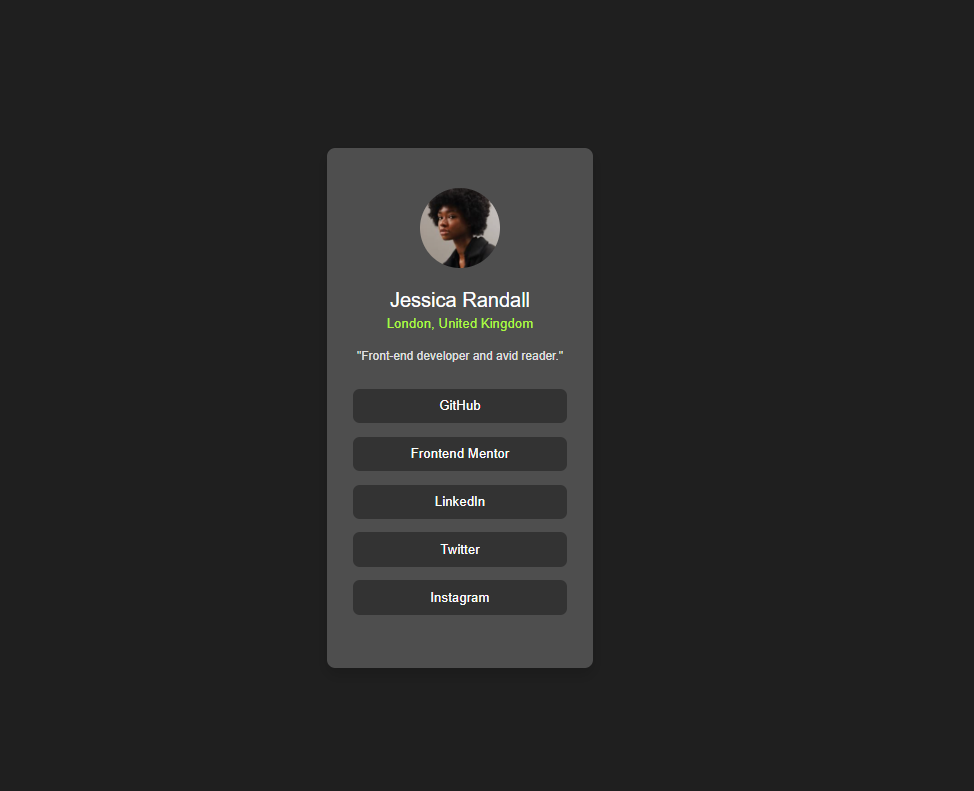

# Frontend Mentor - Social links profile solution

This is a solution to the [Social links profile challenge on Frontend Mentor](https://www.frontendmentor.io/challenges/social-links-profile-UG32l9m6dQ).  
Frontend Mentor challenges help you improve your coding skills by building realistic projects.

## Table of contents

- [Overview](#overview)
  - [The challenge](#the-challenge)
  - [Screenshot](#screenshot)
  - [Links](#links)
- [My process](#my-process)
  - [Built with](#built-with)
  - [What I learned](#what-i-learned)
  - [Continued development](#continued-development)
  - [Useful resources](#useful-resources)
- [Author](#author)
- [Acknowledgments](#acknowledgments)

---

## Overview

### The challenge

Users should be able to:

- See hover and focus states for all interactive elements on the page

### Screenshot




### Links

- Solution URL: [solution](https://www.frontendmentor.io/solutions/)
- Live Site URL: [live site]([https://your-live-site-url.com](https://therazorbill.github.io/social-links-profile-main/))

---

## My process

### Built with

- Semantic **HTML5**
- **CSS3** (Flexbox and custom properties)
- **Mobile-first workflow**
- Simple, clean design inspired by the Frontend Mentor challenge

### What I learned

This project helped me reinforce my understanding of **semantic HTML structure** and **basic CSS layout techniques** using **Flexbox** for centering and alignment.

One area I improved was styling anchor links (`<a>`) to look like buttons and removing their default blue color and underline:

```css
.social-links a {
  text-decoration: none;
  color: #fff;
  background-color: #333;
  padding: 0.8rem;
  border-radius: 8px;
  transition: all 0.3s ease;
}

.social-links a:hover {
  background-color: rgb(172, 248, 65);
  color: #1f1f1f;
  transform: scale(1.02);
}
